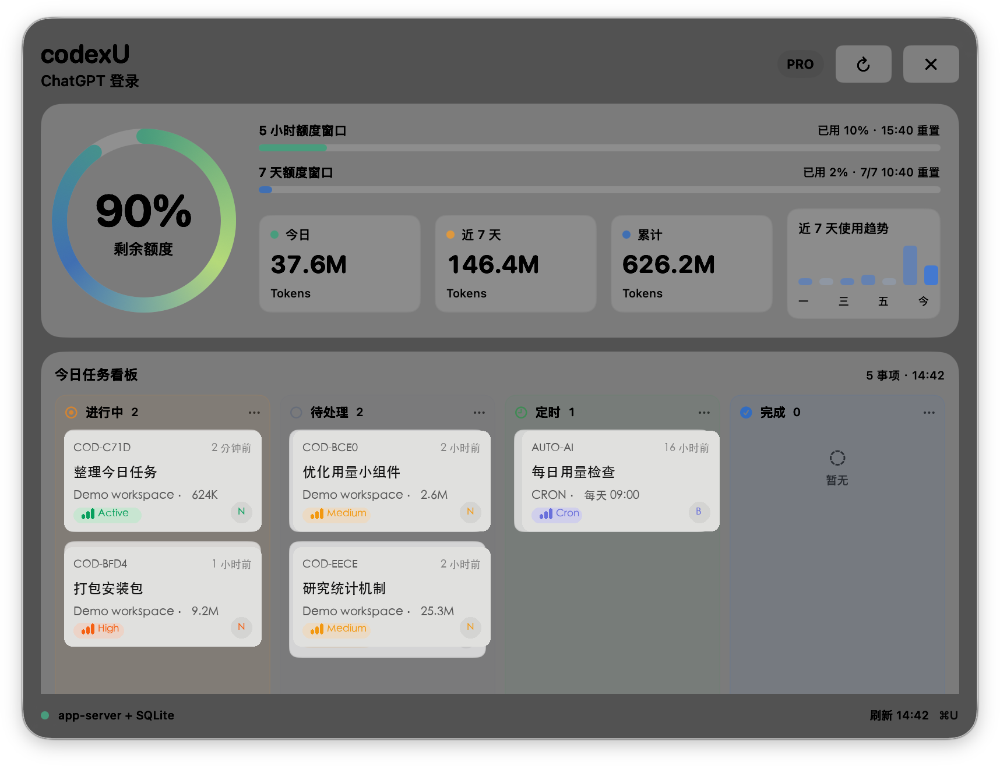

# codexU

codexU is a local macOS desktop widget for Codex usage. It reads account quota from the official local `codex app-server`, aggregates local token usage from `~/.codex/state_5.sqlite`, and shows today's Codex work as a compact desktop board.



## Features

- Shows remaining Codex quota for the 5-hour and 7-day windows, including reset times.
- Summarizes local token usage for today, the last 7 days, and lifetime totals.
- Displays a 7-day usage trend for quick daily comparison.
- Builds a daily task board from local Codex threads and enabled Codex automations.
- Groups work into active, pending, scheduled, and done columns.
- Stays on the desktop layer by default, with one-key foreground toggle.
- Runs locally. The widget reads local Codex files and local Codex app-server responses; it does not upload usage data to a third-party service.

## Keyboard Shortcuts

- `Command + U`: toggle the widget between desktop layer and foreground layer.
- Menu bar gauge icon: same toggle as `Command + U`.
- Refresh button: immediately refresh quota, token usage, trend, and task board.
- Close button: quit the widget.
- Drag anywhere on the widget background to reposition it.

## First Install: Privacy & Security

codexU is distributed outside the Mac App Store. On first launch, macOS may block it until you manually allow it:

1. Open `codexU.app` once. If macOS says it cannot be opened, cancel the dialog.
2. Open **System Settings > Privacy & Security**.
3. In the **Security** section, click **Open Anyway** for `codexU.app`.
4. Confirm with Touch ID or your password, then click **Open**.

You can also right-click `codexU.app` in Finder and choose **Open**, then confirm the same security prompt.

codexU needs access to local Codex data under `~/.codex/`. If macOS asks for file or folder access, allow it so the widget can read local usage, threads, and automation metadata.

## Requirements

- macOS 14 or later.
- A local Codex installation.
- A signed-in Codex account for quota data.
- Codex must have been used at least once so `~/.codex/state_5.sqlite` exists.
- Xcode Command Line Tools for building from source.

## Build From Source

```sh
make build
```

Run the app:

```sh
make run
```

Install to `/Applications`:

```sh
make install
```

Inspect the data source output:

```sh
make probe
```

## Package A DMG

```sh
make release
```

Release artifacts are written to `dist/`, for example:

```text
dist/codexU-0.1.2-mac-arm64.dmg
dist/codexU-0.1.2-mac-arm64.dmg.sha256
```

For Developer ID signing and notarization, see [DISTRIBUTION.md](DISTRIBUTION.md).

## Data Sources

- Account and quota: `codex app-server` JSON-RPC methods `account/read`, `account/rateLimits/read`, and `account/usage/read`.
- Local token usage: `~/.codex/state_5.sqlite`.
- Today's board: unarchived and archived Codex threads in the local SQLite database.
- Scheduled tasks: enabled automation metadata under `~/.codex/automations/**/automation.toml`.

Current Codex quota APIs expose rolling-window percentages and reset times, not absolute account quota sizes. See [RESEARCH.md](RESEARCH.md) for the data model and fallback behavior.

## License

MIT. See [LICENSE](LICENSE).
